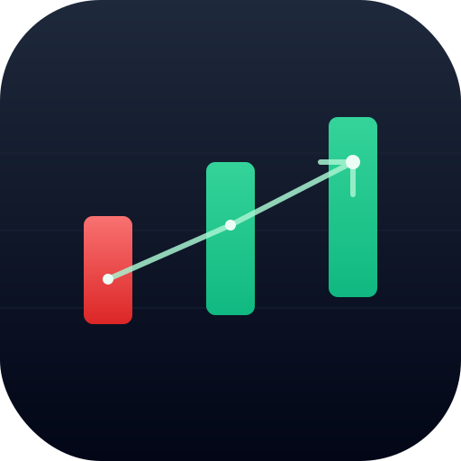

# ai-stock

크로스플랫폼 데스크탑 앱 — 미국 주식, 한국 주식, 암호화폐, FX/원자재를 한 화면에서 실시간으로 추적하고, 보유 자산의 평가/손익을 즉시 계산하며, 선택적으로 BYOK AI에게 코멘트를 요청합니다. macOS / Windows / Linux 동작.



## 주요 기능

- **워치리스트** — Binance · CoinGecko · Yahoo · Finnhub · Naver · 한국투자(KIS) OpenAPI를 자동 폴백해 가며 폴링
- **포트폴리오** — 보유 자산 입력 → 실시간 평가/손익. 통화가 섞이면 Yahoo FX(USDKRW=X 등)로 합산
- **차트 + 지표** — 캔들 + SMA20/50 · RSI(14) · MACD(12,26,9) · 볼린저 밴드 · 거래량. 1분 ~ 1주 봉 프리셋
- **가격 / 지표 알림** — 임계값 알림, RSI 과매수/과매도, MACD 골든/데드 크로스. OS 네이티브 알림으로 발송
- **AI 코멘트 (BYOK)** — OpenAI · Anthropic · Gemini 스트리밍. 키는 OS 키체인에 암호화 저장
- **플로팅 위젯** — 항상 위에 떠 있는 미니 창, 투명도 슬라이더
- **테마** — 라이트 / 다크 / 시스템 + macOS Vibrancy · Win11 Mica · Win10 Acrylic

## 아키텍처

DDD 레이어드 + 프로바이더 추상화. 모든 외부 의존성은 trait 뒤에.

```
crates/
  domain/          # 순수 — Money, Symbol, Portfolio, Indicators, AlertRule, FxRates
  application/     # 트레잇 ports + Market/Portfolio/Alert/Ai 서비스
  infrastructure/  # 어댑터 — Sqlite, Keychain, Reqwest, 6개 시세 프로바이더, 3개 AI, 2개 뉴스
app/               # Tauri 2 바이너리 (IPC + 이벤트 + 와이어링)
src/               # React + Tailwind + Zustand (메인 윈도우 + 위젯 + 다이얼로그)
```

레이어 의존성은 `scripts/check-layer-boundary.sh`로 강제. 도메인은 IO 의존성 0.

## 데이터 소스

| 자산 | 1차 소스 | 폴백 |
|---|---|---|
| Crypto | Binance | CoinGecko |
| US Equity | Finnhub (BYOK) | Yahoo `/v8/chart` |
| KR Equity | KIS OpenAPI (BYOK) | Naver Finance 스크래핑 |
| FX / Commodity | Yahoo `/v8/chart` | — |
| News | Yahoo News RSS · CoinDesk RSS | — |

미국 주식은 Yahoo `/v7/quote`가 인증 차단되어서, 우리는 `/v8/chart`의 `meta.regularMarketPrice`로 우회합니다. Finnhub는 무료 키로도 quote 가능 (캔들은 paid).

## 개발 실행

```bash
# 사전 요구사항
# - Rust ≥ 1.77
# - Node.js ≥ 20

npm install
FINNHUB_API_KEY=...  # (선택) 미국 주식 1차 소스
npm run tauri dev
```

빌드:

```bash
npm run tauri build
# 산출물: target/release/bundle/ (macOS: .app / .dmg)
```

로컬 릴리스 빌드 절차(사전 요구사항, 서명되지 않은 앱 실행법 등)는
[docs/RELEASE.md](docs/RELEASE.md) 참고.

## 테스트

```bash
cargo test --workspace                  # 도메인 + 애플리케이션 + 인프라
cargo clippy --workspace --all-targets -- -D warnings
bash scripts/check-layer-boundary.sh    # DDD 레이어 규칙 검증
npm run typecheck
npm test                                # 프론트엔드 (vitest)
```

## 설정 (앱 안에서)

헤더 우측 **설정** 버튼 → 5개 섹션:

- **화면** — 테마, 표시 통화
- **데이터** — 폴링 주기 (1~60초, 실시간 반영)
- **위젯** — 플로팅 위젯 투명도
- **AI API 키** — OpenAI / Anthropic / Gemini BYOK
- **한국투자 OpenAPI** — `app_key` / `app_secret` BYOK (https://apiportal.koreainvestment.com)

모든 키는 OS 키체인(macOS Keychain / Windows Credential Vault / Linux libsecret)에 암호화 저장. 우리 디스크에는 평문 키가 절대 남지 않습니다.

## 문서

- `docs/superpowers/specs/2026-05-13-ai-stock-design.md` — 디자인 스펙
- `docs/superpowers/plans/` — 마일스톤별 구현 플랜
- `docs/CONTEXT.md` — 도메인 용어 사전 + 현재 상태
- `docs/progress.md` — 단계별 변경 로그
- `docs/adr/` — 아키텍처 결정 기록 (cargo-deny → grep 스크립트 피벗 등)

## 라이선스

MIT.
